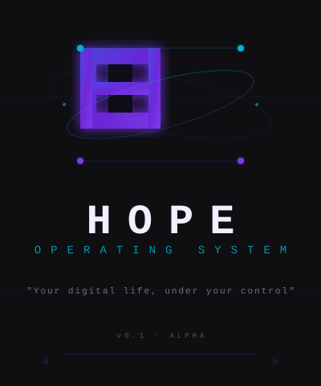

# Hope OS

> *"Your digital life, under your control."*



## What is Hope OS?

Hope OS is a privacy-first operating system for humans who want:
- An computer that just **works**
- Control over their own data
- No surveillance or telemetry
- Auditable, open source code
- Beautiful, modern interface

## Quick Start

```bash
# Clone the repository
git clone https://github.com/lvs0/Hope.git
cd Hope

# Build everything
make all

# Or build specific components
make kernel
make packages
make iso
```

## Features

### 🔒 Privacy First
- No telemetry or tracking
- Local AI processing
- E2E encrypted sync via Polygone
- LUKS2 full-disk encryption option

### 🚀 Fast & Light
- Boot < 4s on ThinkPad X250
- < 600MB RAM at idle
- linux-zen kernel with localmodconfig
- BFQ I/O scheduler optimized

### 🤖 AI Integrated
- **Spotlight**: Phi-3.5-mini local launcher, < 200ms
- **Deep Work**: Granite 3.1 for complex tasks
- **Voice**: Whisper-tiny for voice commands

### 🔧 HAL+ Hardware Layer
- Rust daemon for automatic driver detection
- Vendor:product ID database
- Simple notifications (1 question, 3 buttons max)
- No jargon in user communications

### 💾 Smart Storage
- Btrfs with 30-second rollback snapshots
- ZRAM zstd compression for ≤8GB RAM
- Polygone E2E file sync

## Documentation

- [BUILD.md](docs/BUILD.md) — How to build Hope OS
- [ARCHITECTURE.md](docs/ARCHITECTURE.md) — System design
- [INSTALL.md](docs/INSTALL.md) — Installation guide

## Status

🚧 **Under development** — Spec v0.1

## Contributing

See [CONTRIBUTING.md](CONTRIBUTING.md) for how to contribute.

## License

MIT or Apache-2.0

---

**Hope OS** — Your digital life, under your control.
